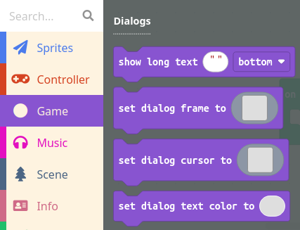

Act 1 will set the scene for the game, introduce characters and their stories, and display any introductory dialog before gameplay begins.

When developing a software product such as an arcade game it is important to remember the concept of **minimum viable product** (MVP). The MVP is an early, basic version of the game that is just enough for a user to play the game. Once an MVP version of the game has been created, the developer then goes back and adds new features, makes improvements, etc.

For example the MVP for Act 1 might be a simple text box introducing the main character and explaining what the goal of the game is. This can be accomplished using a dialog frame or a "long text" block found under Game:

After developing the MVP for Act 1, move on to developing code for Acts 2, 3, 4, and 5. After the MVP for the entire game has been completed, you can add additional features to Act 1 such as:
* Set a background image.
* Add a screen effect.
* Play a song in the background.
* Display multiple dialog boxes in a row, possibly changing the background image in between each, to tell a more in-depth story.