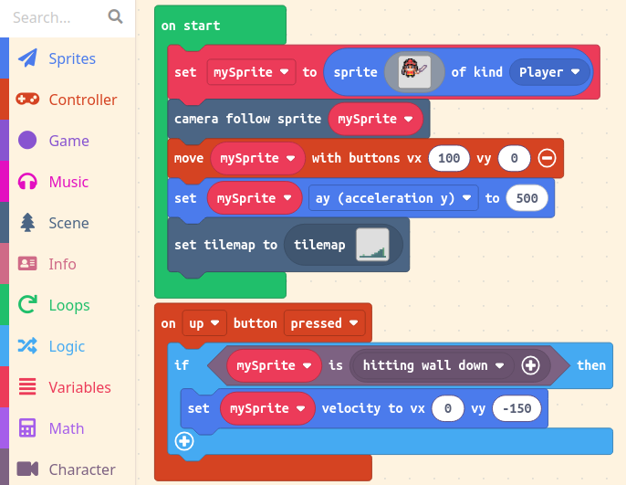
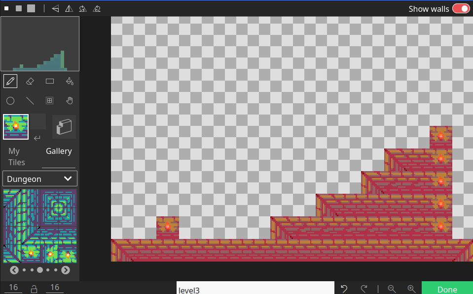

Act 2 is where the player moves around and interacts with the environment. Non-player characters (NPC's) are introduced, and interactions between the main player and NPC's are programmed.

Use a tilemap to design the player's environment, and use walls to define the boundaries. Here is a short example of a game that lets the user move and jump around on top of "walls":

The tilemap defines the walls and uses a dungeon theme:

