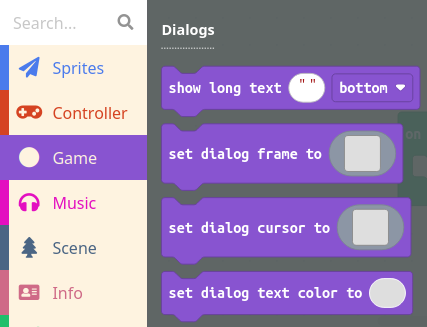

L’Acte 1 met en scène le jeu, présente les personnages et leurs histoires, et affiche les dialogues d’introduction avant le début du jeu.

Lors du développement d’un produit logiciel tel qu’un jeu d’arcade, il est important de garder à l’esprit le concept de **produit minimum viable** (MVP). Le MVP est une version initiale et basique du jeu, juste assez complète pour qu’un utilisateur puisse y jouer. Une fois qu’une version MVP du jeu a été créée, le développeur revient ensuite pour ajouter de nouvelles fonctionnalités, améliorer le jeu, etc.

Par exemple, le MVP de l’Acte 1 pourrait être une simple boîte de texte présentant le personnage principal et expliquant l’objectif du jeu. Cela peut être réalisé à l’aide d’un cadre de dialogue ou d’un bloc de « texte long » trouvé sous Game :

Après avoir développé le MVP de l’Acte 1, passez à la programmation des Actes 2, 3, 4 et 5. Une fois que le MVP du jeu complet a été réalisé, vous pouvez ajouter des fonctionnalités supplémentaires à l’Acte 1, telles que :
* Définir une image de fond.
* Ajouter un effet d’écran.
* Jouer une musique en arrière-plan.
* Afficher plusieurs boîtes de dialogue à la suite, en changeant éventuellement l’image de fond entre chacune, pour raconter une histoire plus détaillée.
