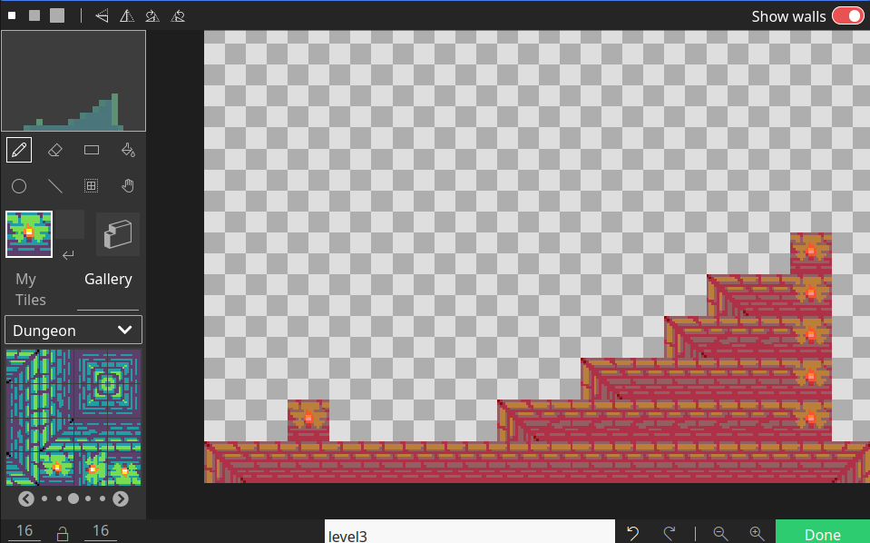

L’Acte 2 est l’endroit où le joueur se déplace et interagit avec l’environnement. Les personnages non-joueurs (PNJ) sont introduits, et les interactions entre le joueur principal et les PNJ sont programmées.

Utilisez une carte de tuiles pour concevoir l’environnement du joueur, et utilisez des murs pour définir les limites. Voici un petit exemple de jeu qui permet à l’utilisateur de se déplacer et de sauter au-dessus de « murs » :

La carte de tuiles définit les murs et utilise un thème de donjon :

