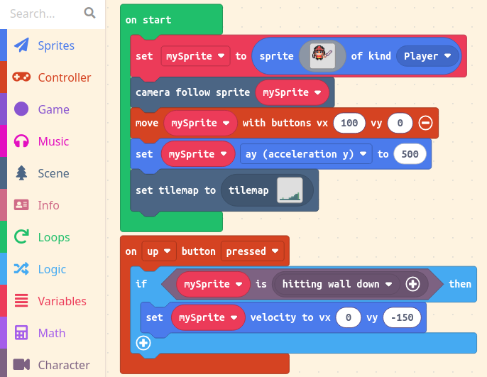

O Ato 2 é o momento em que o jogador se move e interage com o ambiente. Personagens não jogáveis (NPCs) são introduzidos, e as interações entre o jogador principal e os NPCs são programadas.

Use um mapa de tiles para projetar o ambiente do jogador e use paredes para definir os limites. Aqui está um exemplo curto de um jogo que permite ao usuário se mover e pular por cima de "paredes":

O mapa de tiles define as paredes e usa um tema de masmorra:

